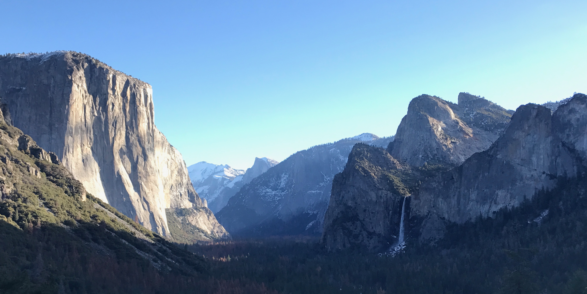

# Welcome to the Jessica Blois Lab

<!-- Hero banner -->

The overarching focus of the Blois Paleoecology Lab is investigating the relationship between species, communities, and the environment, focusing on the past 21 thousand years of life on earth in order to inform the next one hundred years and beyond. We have diverse projects, but they are generally united by a focus on spatio-temporal processes. Our work also has a strong “Conservation Paleobiology” focus, trying to understand how we can use the fossil record to inform our conservation decisions for the future.

You can learn about current work in the Blois lab through the [Publications page]({{ "/publications/" | relative_url }}), Jessica’s [Google Scholar page](https://scholar.google.com/citations?hl=en&user=k3YYLkEAAAAJ&view_op=list_works&sortby=pubdate), or by reading about the lab’s [Research page]({{ "/research/" | relative_url }}).
